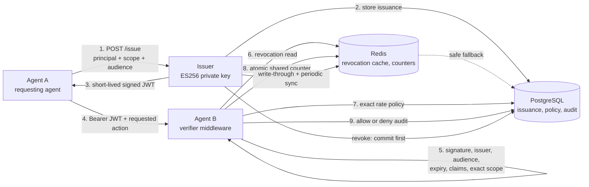

# AgentCred

[](https://github.com/almamun4901/agentCred/actions/workflows/ci.yml)

AgentCred is a working issuer and verifier for short-lived, scoped credentials used
between autonomous services. It demonstrates one narrow security boundary: an agent
may call another service only for the exact action, audience, principal, and lifetime
encoded in a signed credential, and that authority can be revoked before expiry.

The project is deliberately not a new identity protocol or a claim of compliance with
an emerging agent standard. It is an evidence-backed implementation of the underlying
credential, authorization, revocation, rate-limit, and audit mechanics those protocols
need from a resource server.

## Why this exists

A general-purpose bearer token answers “does this caller possess a secret?” It does
not necessarily answer the questions that matter when software acts autonomously:

- Which agent is calling, and for which accountable principal?
- Which receiving service may accept the credential?
- Which exact action was delegated?
- Can the authority be withdrawn before the token expires?
- Can a verifier fail safely when its policy dependencies are unavailable?
- Can an operator reconstruct allowed and denied actions without logging credentials?

This is an active standards problem. The
[NIST AI Agent Standards Initiative](https://www.nist.gov/artificial-intelligence/ai-agent-standards-initiative)
and its
[agent identity and authorization work](https://www.nist.gov/news-events/news/2026/02/new-concept-paper-identity-and-authority-software-agents)
focus on secure agent action on behalf of users. The
[MCP authorization specification](https://modelcontextprotocol.io/specification/2025-06-18/basic/authorization)
uses established OAuth resource-server patterns; the emerging community
[MCP-I specification](https://modelcontextprotocol-identity.io/) explores verifiable
agent identity and delegation; and
[A2A](https://a2a-protocol.org/v0.3.0/specification/) leaves authorization to the
receiving service, including action- and scope-based policy. The IETF
[Agent Authorization Profile draft](https://datatracker.ietf.org/doc/html/draft-aap-oauth-profile-00)
similarly explores JWT claims for agent identity, task constraints, and delegation.

AgentCred implements none of those protocols end to end. It makes their shared
resource-server questions concrete and testable.

## What the demo proves

Agent A first requests a credential for `read:weather`, then attempts to call Agent B's
`read:quote:basic` route. Agent B returns `403 scope_exceeded`. Agent A requests a
second credential with the exact scope and repeats the call; Agent B returns `200`.
Both decisions are written to PostgreSQL without storing or logging the JWT.

```text
DENIED 403 scope_exceeded (read:weather cannot read a quote)
ALLOWED 200 Trust is scoped, verified, and revocable.
Phase 3 demo passed: attempted overreach was blocked, correct scope was allowed.
```

The proof is deterministic rather than “AI theater”: Agent A is a one-shot client and
Agent B serves a static quote, keeping the authorization boundary visible.

## Architecture



The verifier evaluates trust in this order:

1. Verify an ES256 signature and enforce the exact issuer, audience, expiry, JWT type,
   algorithm, and required claim shapes.
2. Check revocation. Redis is the normal path; stale or unavailable cache state falls
   back to authoritative PostgreSQL.
3. Require an exact action string in `scope`.
4. Resolve an exact `(principal, audience, scope)` policy and atomically consume its
   shared Redis fixed-window budget.
5. Persist the finalized decision and return the protected response or a stable denial.

Invalid, revoked, and out-of-scope requests never consume legitimate rate capacity.

## Credential contract

The issuer signs only ES256 JWTs with `{ "alg": "ES256", "typ": "JWT" }`.

| Claim | Example | Security meaning |
|---|---|---|
| `iss` | `agentcred-issuer` | Exact trusted issuer; not caller-controlled at verification time |
| `sub` | `agent-a` | Agent identifier supplied at issuance |
| `principal` | `company-x` | Accountable identity on whose behalf the agent acts |
| `aud` | `agent-b` | Only the intended receiving service may accept the credential |
| `scope` | `["read:quote:basic"]` | Exact permitted action strings; no wildcard or prefix matching |
| `iat` | `1753099200` | Issuance time in Unix seconds |
| `exp` | `1753099500` | Expiry; exactly `iat + ttl`, with a maximum TTL of one hour |
| `jti` | UUID | Unique identifier used for storage and revocation |
| `delegation_chain` | `[]` | Reserved shape; delegation is not implemented in this version |

Credentials are bearer tokens. AgentCred prevents scope, audience, issuer, expiry, and
revocation violations, but it does not bind a token to the caller's key or prevent a
stolen valid token from being replayed within its remaining authority.

## Core verifier cases

These six cases form the original credibility gate. The suite also covers malformed
claims, wrong issuer, cache failure, rate limiting, HTTP mappings, observer isolation,
and concurrent shared-counter behavior.

| Case | Expected decision | What it proves |
|---|---|---|
| Valid signature, audience, scope, and active JTI | Allow | The intended request crosses the boundary |
| Expired credential | Deny `expired` | Short lifetime is enforced with zero clock tolerance |
| Wrong audience | Deny `aud_mismatch` | A token issued for one service cannot be replayed at another |
| Revoked JTI | Deny `revoked` | Authority can be withdrawn before JWT expiry |
| Missing exact action | Deny `scope_exceeded` | Possessing a valid token does not grant broader capability |
| Tampered signature | Deny `invalid_signature` | Claims are trusted only after ES256 verification |

Middleware maps unusable credentials to `401`, insufficient scope to `403`, exhausted
budgets to `429` with `Retry-After`, and unavailable verification dependencies to
`503`. Stable result types and the complete route contract are documented in
[API_REFERENCE.md](./API_REFERENCE.md).

## Run the container demo

Prerequisites: Node.js 22+, pnpm 10.30.1, Docker, and Docker Compose.

```sh
pnpm install --frozen-lockfile
docker compose up --build --wait
docker compose --profile demo run --rm agent-a
```

The Compose stack creates or reuses a local ES256 signing identity, starts PostgreSQL
and Redis, then health-gates the issuer and Agent B. Application containers run as UID
10001 with read-only root filesystems and dropped Linux capabilities. Agent B receives
only the public-key volume; no application image contains a PEM or key file.

Inspect the printed demo principal's two audit rows:

```sh
docker compose exec -T postgres psql -U agentcred -d agentcred -c \
  "SELECT decision, denial_reason, requested_action, audience, verified_at FROM verification_log WHERE principal = 'PASTE_PRINTED_PRINCIPAL' ORDER BY id;"
```

Stop the stack without deleting its database, cache, or signing identity:

```sh
docker compose down
```

`docker compose down --volumes` intentionally deletes all local state, including the
signing identity.

## Evidence, not assertions

### Automated verification

The required GitHub `CI` check runs on every push and pull request with read-only
repository permission. It performs a frozen install, lint, 109 unit tests, 14
real-backend integration cases, every workspace typecheck and build, a three-path
benchmark smoke run, and the clean-volume container security/demo lifecycle. It builds
the issuer, Agent A, and Agent B images but never publishes them.

The merge gate was proven red and green: a deliberately broken test failed CI in
33–39 seconds, and the isolated revert restored passing runs. `main` requires the
strict `CI` context, including for administrators; force pushes and deletion are
disabled.

Run the same complete gate locally:

```sh
pnpm services:up
pnpm lint
pnpm phase8:verify
```

### Revocation consistency

PostgreSQL is authoritative. `POST /revoke` commits there first, then writes through to
Redis. A successful response makes the revocation immediately visible. If Redis
propagation fails after the commit, the issuer returns retryable `503` and an
idempotent retry republishes the immutable record.

Out-of-band database writes are eventually consistent. A five-second full synchronizer
maintains a freshness lease in Redis; a fresh miss is trusted, but an expired lease,
malformed cache value, or Redis error falls back to PostgreSQL. If both sources fail,
verification fails closed.

The recorded walkthrough observed its final stale allow at 4.923 seconds and its first
denial at 5.029 seconds after a direct PostgreSQL revocation, with 100 ms polling. This
is a measured stale-read window, not an “instant revocation” claim.

### Rate limiting

Policies live in PostgreSQL and are keyed by `principal:audience:scope`; counters live
in Redis and are updated atomically with Redis server time. The key deliberately
excludes `jti`, so rotating credentials cannot reset a principal's budget. Missing
policies mean unlimited access; policy or counter failures fail closed.

The implementation uses a fixed window because it is small and explainable. It allows
boundary bursting and is not presented as the fairest production algorithm.

### Measured verifier paths

These results are from three five-second trials after a two-second warm-up on an Apple
M5 Pro. Requests use Fastify's in-memory injection path: JWT and middleware work are
included; socket latency and audit writes are excluded.

| Scenario | p50 | p95 | p99 | Peak throughput |
|---|---:|---:|---:|---:|
| PostgreSQL revocation | 1.679 ms | 2.676 ms | 3.472 ms | 18,331 req/s |
| Redis revocation | 0.795 ms | 1.190 ms | 2.702 ms | 46,454 req/s |
| Redis revocation + PostgreSQL policy + Redis limit | 2.152 ms | 3.297 ms | 4.258 ms | 15,268 req/s |

Redis reduced median revocation latency by 52.7% and reached 2.53× the direct
PostgreSQL path's peak throughput on this machine. The rate-limited path shows the cost
of an exact database policy read on every limited request. These are comparative local
middleware measurements, not production capacity claims. Full methodology, operation
counts, and reproduction flags are in [PERFORMANCE.md](./PERFORMANCE.md).

## Design choices and tradeoffs

| Choice | Why | Cost / revisit condition |
|---|---|---|
| ES256 asymmetric signing | Verifiers need only a public key; no shared signing secret crosses the boundary | Rotation requires overlapping keys and a key-discovery mechanism |
| Exact `aud` and scope enforcement | Prevents cross-service replay and capability overreach | No hierarchical or wildcard permission model |
| PostgreSQL authority + Redis cache | Preserves durable revocation truth while accelerating normal reads | Out-of-band writes have a bounded stale window |
| PostgreSQL policy + Redis counter | Policy changes apply immediately and replicas share enforcement | Adds a database read to every limited request |
| Fail-safe verification fallback | Cache failure never silently becomes “not revoked” | Dependency failures can reduce availability with `503` |
| Awaited audit observer | Keeps responses closely correlated with durable evidence | Adds a database round trip; audit failure is logged but does not reverse authorization |
| Immutable non-root images | Makes the local artifact close to a production runtime baseline | Local named volumes are not production secret management |

Detailed alternatives, consequences, and revisit conditions are recorded in
[DECISIONS.md](./DECISIONS.md).

## What this does not solve

- **No production issuer authentication.** `/issue` and `/revoke` are intentionally
  unauthenticated and loopback-only. A deployed issuer must authorize callers and
  revocation operators.
- **No key rotation or discovery.** One issuer and one ES256 keypair are configured
  directly; there is no `kid`, JWKS endpoint, trust federation, or overlapping-key
  rollout.
- **No proof of possession.** A stolen live JWT can be replayed within its audience,
  scope, and remaining lifetime.
- **No delegation semantics.** `delegation_chain` is structurally validated but always
  issued empty; user consent, transitive constraints, and chain verification are out of
  scope.
- **No multi-issuer policy model.** Agent B trusts one configured issuer and exact
  action strings only.
- **No zero-staleness revocation.** Direct database writes can remain usable until the
  next cache synchronization; API revocations use immediate write-through.
- **No perfect rate-limit fairness.** Fixed windows permit boundary bursts, and policy
  lookups are not cached.
- **No guaranteed audit durability.** Agent B retries an audit insert once, logs a
  structured gap if both writes fail, and preserves the already-finalized authorization
  response.
- **No production network perimeter.** Compose binds host ports to loopback and has no
  TLS, WAF, load balancer, multi-region availability, or production observability.
- **No AWS deployment yet.** Terraform infrastructure and continuous deployment are
  intentionally deferred; the implemented artifact is local plus GitHub CI.

## Repository map

```text
issuer/                 ES256 issuance, revocation API, Redis synchronizer
verifier-sdk/           reusable verifier, Fastify middleware, cache/rate adapters
demo-agents/agent-a/    deterministic deny-then-allow client
demo-agents/agent-b/    protected quote service and audit integration
db/                     PostgreSQL schema, migration, and denial report
scripts/                isolated clean-container verification
.github/workflows/      required CI gate; deployment remains a placeholder
```

Useful references:

- [API_REFERENCE.md](./API_REFERENCE.md) — endpoint, claim, middleware, and
  configuration contracts
- [PERFORMANCE.md](./PERFORMANCE.md) — benchmark methodology and evidence
- [DECISIONS.md](./DECISIONS.md) — architecture decision records
- [RUNBOOK.md](./RUNBOOK.md) — operational failure notes
- [PROJECT_PLAN.md](./PROJECT_PLAN.md) — implementation history and deferred phases

## Deferred AWS deployment

Terraform and AWS continuous deployment have not been implemented, so this repository
does not claim operational lessons it has not earned. When cloud work resumes, the
intended small architecture is ECR plus ECS/Fargate, RDS PostgreSQL, Secrets Manager,
and either an in-task Redis sidecar for cost control or ElastiCache for managed-service
realism. Phase 10 must prove `plan`, `apply`, and `destroy`; Phase 11 must prove image
publication, task-definition revision, deployment health, and the same deny-then-allow
smoke path before any AWS claims are added here.

## Current status

Phases 0–9 and 12 are implemented locally and enforced by CI. AWS infrastructure
(Phase 10) and continuous deployment (Phase 11) are intentionally deferred until cloud
work resumes. The next production-oriented step is therefore not “add more agent
behavior”; it is to add authenticated issuer operations, managed keys and rotation,
network controls, and a deliberately small deployment architecture.
